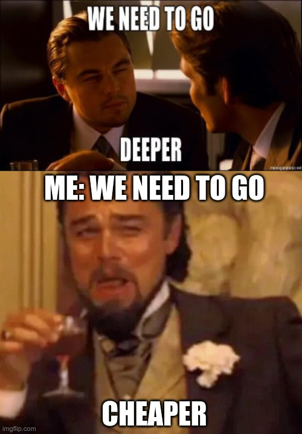
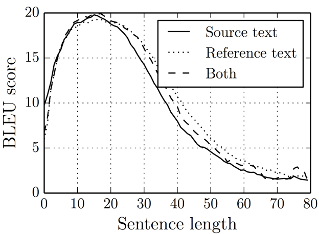
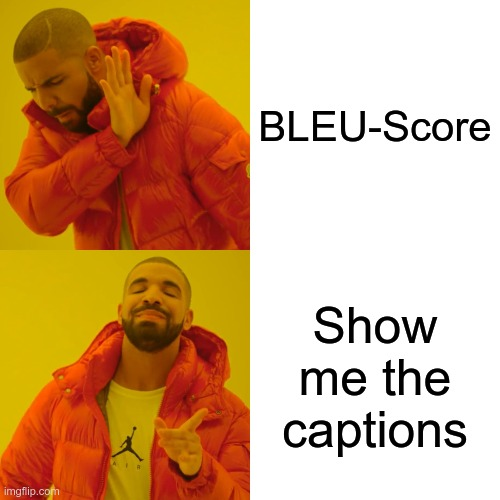
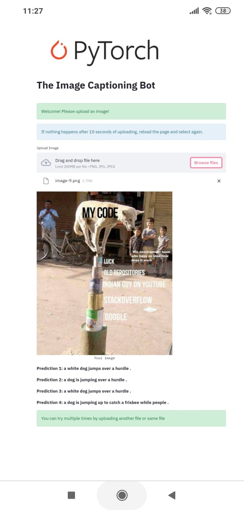

# [CaptionBot - Implementation of Show, Attend and Tell](https://arxiv.org/pdf/1502.03044.pdf)

README in progress. (Partially complete)

The [Caption Bot](https://share.streamlit.io/sankalp1999/image_captioning/main) takes your images and generates a caption in less than 40 words (even though a picture is worth a thousand words.....)

---

## Try the CaptionBot yourself!

Check out yourself [here](https://share.streamlit.io/sankalp1999/image_captioning/main).


You can check some of the results [below](https://github.com/sankalp1999/Image_Captioning/blob/main/README.md#the-good).

---

## Repository structure 
The repository is divided into the following structure into three parts

1. [Pytorch model files](https://github.com/sankalp1999/Image_Captioning/tree/main/pytorch_model) - You can find the actual pytorch model files here. The .ipynb file(Kaggle kernel) on which the model was trained can be found in Kaggle notebook folder. 
2. Flask_App - this is inside main/pytorch_model. This was meant to deployed using flask. The requirements.txt here is specifically for deployment using Flask.
3. Main branch -  Deployment using streamlit. Files required for streamlit deployment are here.

You can download the weights from [Decoder_weights](https://www.dropbox.com/s/5ntq1bgp33k1197/LastModelResnet50_v2_16.pth.tar?dl=0) and [Encoder_Weights](https://www.dropbox.com/s/fot9zzgszkpsab7/resnet50_captioning.pt?dl=0).

Note: You can directly use resnet50(pretrained = True) because I did not fine-tune the resnet50.
Only the decoder is trained.


--- 

## How to run on local machine

1. Clone the repository

```python
git clone https://github.com/sankalp1999/Image_Captioning.git
cd sankalp1999/Image_Captioning.git
```

2. Make a new virtual environment (Optional)

```python
pip install --user virtualenv
```

You can change name from .env to something else.

```
virtualenv -p python3 .env
source .env/bin/activate
```

3. Install the required libraries. 

**Option 1** To train a similar model or see inference on Flask

```python
cd pytorch_model
pip install -r requirements.txt 
```

You will have to download the weights and keep it some proper path that you want to use.

Only inference

```python
# To try out just the inference, set image_path in file manually.
python inference.py

# For Flask app
cd Flask_App
python app.py
```

**Option 2**  Streamlit  Note that, this is the requirements.txt in the main branch. Additionally, you need to install wget command. 

```python
pip install -r requirements.txt
apt-get install -r packages.txt # Optional way to install wget
```

```python
# Note weights will get automatically downloaded. You have to set the right path
# in the streamlit_app file. If you have already downloaded, just place 
# in the path and make the changes in streamlit_app file also

streamlit run streamlit_app.py # Run the app on local machine

```

Additional note: The only difference between the requirements.txt files is streamlit.
Streamlit is a great platform which made the deployment part much easier. It's harder to deploy on Heroku.


## The Good

---

---

---

---


## Streamlit samples

---


Let's see how this was possible.
## Model Architecture

### General idea

The model works on sequence-to-sequence learning (Seq2Seq). This was introduced by [google](https://papers.nips.cc/paper/2014/file/a14ac55a4f27472c5d894ec1c3c743d2-Paper.pdf) in 2014.(Check out [this](https://www.youtube.com/watch?v=MqugtGD605k&ab_channel=Weights%26Biases)  and  [video](https://youtu.be/oF0Rboc4IJw) for a quick understanding of the key concepts.)

So in simple words, the encoder's task is to identify the features of the input (text in NMT or image in Image Captioning). These representations are provided to the "Decoder" to decode some outputs. 

The encoder for example take CNN continuously downsamples (convolution and max pooling continously take max of the pixels. This retains only the most important information). Then we can pass the (embedding of the words + features NMT), (embedding + CNN features IC)  upsample it once and provide it to the decoder. 

Finally, we can decode the output by continuously passing the word predicted (Each word is dependent on the previously predicted words —> Conditional language modelling since we use conditional probability).  This is called greedy decoding.

To get better predictions, we use beam search. We keep track of **k most probable partial translations.** It does not guarantee an optimal solution but it is better than greedy decoding in most cases.  ****

The key thing is that we can do end-to-end training with image-text, text-text by getting the outputs from the decoder, weighing against the ground truths and perform the gradient steps. 

**Given enough such pairs, the model will work.**

For more details of the concepts, refer [CS224N, Lecture 8](https://youtu.be/XXtpJxZBa2c).

## Implementation Details and Concepts involved

Based on the paper - Show, Attend and Tell

### Dataset

Flickr8K- It is a relatively small dataset of 8000 images with 5 captions each. There are two versions found on the web - one with splits and one without splits. I used the latter and created manual split. 


### Encoder

**Use of transfer learning**

Other existing (better) implementations use deeper CNN's (Resnet 101, 152) 



But for (free) deployment purposes, size constraints. 

> Resnet 101 weights are around 170 MB while resnet-50 are around 98 MB. Heroku gives around ~ 500 MB while Streamlit ~800 MB storage.

I use a pre-trained Resnet 50 model (without fine-tuning). Resnet-50 is trained on ImageNet which contains a lot of dogs (which explains the model's liking for dogs.)

We remove the last three layers( as more spatial information can be found in the lower layers).  And take the feature representation. Then, reshaping and permuting is needed for operations in the decoder. The paper mentions to bring the shape to (batch_size, num_pixel = 14 x 14 , encoder_dim = 1024)

Final encoding before passing to decoder will be (batch_size, 14, 14, 1024 ). This is called as the annotation vector in the paper.

Check in the pytorch_model/model.py . 

### Embedding layer

The embeddings are trained on the vocabulary of Flickr8K. I decided to not use pretrained-embeddings because of size-constraints and secondly it has been found that training on your dataset's vocabulary is sometimes equally accurate (because of context of the images and captions). 

The vocabulary threshold is 2 (although the initial models I had trained had a vocabulary threshold of 5). The threshold means the number of occurences of the word to include it in my vocabulary which is a mapping of words to indices and vice-versa. 

With threshold = 2, vocab size is 5011. I saw a decrease in BLEU score but better captions.

With threshold = 5, vocab size was 2873.

### Decoder

We use an nn.LSTMCell and not nn.LSTM. It's easier to get the hidden steps at each time step from LSTMCell. I won't put a picture here of LSTMCell equations because they scare me.

### Attention network (soft attention)

A huge problem with Encoder-Decoder network without attention is that the LSTM's performance declines rapidly as the sequences keep getting longer. This was a big problem in the Machine translation task. Naturally, even human beings find it hard to memorize long sentences. 

This problem was because of calculating only one context vector in which you squash all the information.

But if you observe translators, they hear the sentence pieces, give attention to certain pieces and then translate. They don't memorize the whole thing at once and then translate. Attention works in the same way.  **We focus on specific objects with high resolution.**



To address this issue, in 2014 soft attention was first introduced in **[Neural Machine Translation by Jointly Learning to Align and Translate](https://arxiv.org/pdf/1409.0473.pdf).**  The authors of ShowAttendTell adapt the same for this model.

Coming back to CaptionBot, we pass the encoding(features) along with the hidden state(all the timesteps) of current batch to the attention network. **Here, we calculate context for each hidden state timestep and return a context vector.**

Thus, this seems like the model can attend to different features of the image and get the "context".

We pass this context vector with the embedding to the decoder. Then, we get the predictions and repeat. (Train time) 


For better visualization, refer [this](https://youtu.be/StOFwSRBwMo) video.

The BahdanauAttention class in the [model.py](http://model.py) file is implementing the attention network which calculates the attention weights(alphas) and context vector.


### Greedy decoding

Selects the best prediction and passes the embedding of this prediction along with the context vector. This often works but then you want to be sure that your current choice is optimal, then only your caption will be optimal since the future words are dependent on previous words.


During training time, i used the greedy caption (for the first three-four models). The model could make good captions but it predicted wrong colors. It associated the context of man with red t-shirt a lot of times! 

Suboptimal choice —> Not the best word —> Totally different sentence —> Bad alignment  with image

### Beam Search

Beam search is the game-changer. This part in the code is heavily inspired from sgrvinod implementation.

We maintain top k partial translations with the scores for each sequence. Each sequence may end at a different time step. So, when a sequence finishes, we remove it from the sequence list. We also have a max - sequence length.

Finally, select a sequence with the max score.

The predictions in the CaptionBot are with beam indices 2..5

## Results



The model is giving pretty accurate predictions for most of the items in the dataset and outside also. But the BLEU score is low. This is probably something missing in the model because the authors attained a higher score on the paper.

I calculated the BLEU score over 200 images with 5 captions each and sometimes only 100 images. The scores revolve around. Check ou  the jupyter notebook for these along with captions on images.

```
Torch metrics
BLEU-1 0.35120707074989127
BLEU-2 0.1789211035330783
BLEU-3 0.1054519902420567
BLEU-4 0.06222680791229005
```

The max result the model could achieve once was (this was less than 50 images). 

```
BLEU-1 0.4838709533214569
BLEU-2 0.3417549431324005
BLEU-3 0.28220313787460327
BLEU-4 0.22571180760860443
```

---

## References and Credits

Pytorch Framework for being so incredibly useful.

Streamlit for an amazing deployment experience. 

**Papers** 

[Show, Attend and Tell](https://www.youtube.com/redirect?q=https%3A%2F%2Farxiv.org%2Fpdf%2F1502.03044.pdf&v=W2rWgXJBZhU&redir_token=QUFFLUhqbV90V2s0TVhUWnYyNm9Tb25OVlUyVUNRaFdkd3xBQ3Jtc0tsbGNJcXFHejFqbUNmV1lUWlZYS1JTYmxlRk1FUF82SG15TFlfQmZzUEs4a3FvSFJnQlI0dm5YX3pKMG1PaDFKYjBTblc3ZnlGMFNNZTN6X2VoSU5lWHpaakxJNkJxaWF4OHlTdTZzQm9PRUhRSHJSOA%3D%3D&event=video_description)

[Show and Tell](https://arxiv.org/abs/1411.4555)



**Implementations referred**

Stackoverflow for 100's of bugs I faced.

[aladdinpersson](https://github.com/aladdinpersson/Machine-Learning-Collection/tree/master/ML) - He has a Youtube channel on which he makes detailed tutorials on applications using Pytorch and TensorFlow.

[sgrvinod](https://github.com/sgrvinod/a-PyTorch-Tutorial-to-Image-Captioning) - Must refer. Although, I would say my implementation easier on the eye.

[mnmjh1215](https://github.com/mnmjh1215/show-attend-and-tell-pytorch) - Old implementation

Special thanks to great friend [@sahilkhose](https://github.com/sahilkhose) for helping and guiding me in tough situations.

---


